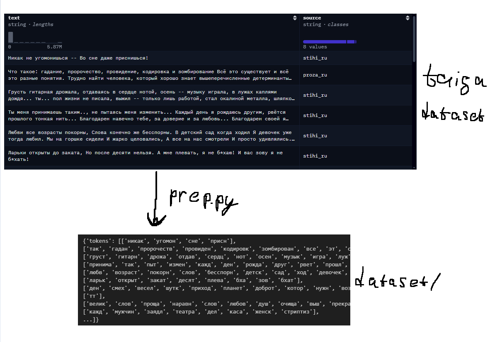
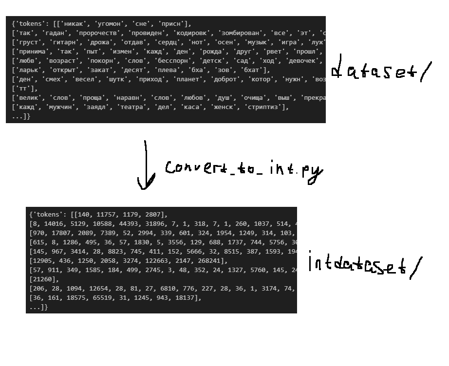

# word2vec with negative sampling
.....

# Пайплайн
## Предобработка исходного датасета
За датасет была взята [0x7o/taiga](https://huggingface.co/datasets/0x7o/taiga). Первичная предобработка реализована в [prep.py](prep.py). Все слова приведены к нижнему регистру, убрана пунктуация, цифры, лишние пробелы. После этого каждая строка была преобразована в список слов. 

*здесь и в последующих картинках '/' на конце означает локальную директорию*

## Преобразование токенов в числа
Так как в конечном итоге взаимодействовать с токенами мы будем с помощью чисел через эмбеддинги, а преобразовывание str -> int при каждом обращении к токену замедлит процесс обучения, я преобразовал все токены в int заранее. Словарь, в котором написано, какой токен какому числу соответствует, сохранен в виде json файла. Размер словаря получился в 2495767 слов. Весь процесс описан в [convert_to_int.py](convert_to_int.py) 

## Извлечение пар [target, context]
Датасет, которым мы будем пользоваться во время обучения, состоит из двух колонок. target - целевое слово, и context - слово, находящееся с target в одном контексте (в пределах window_size). 

В [pairs_dataset.py](pairs_dataset.py) эти пары вычисляются и поточно записываются по 50млн пар в каждый шард. Исходя из размера словаря можем хранить не int64, а в int32.

Про негативные примеры (negatives) - их мы будем генерировать с помощью заранее подготовленной unigram table. Это выгодней, чем считать их на лету, каждый раз считая распределение заново.

## Итерационный датасет 
В [dataset.py](dataset.py) реализован поточный датасет, проходящий по одному parquet файлу из 50млн пар. Так же в нем мы используем полученное в [unigram_table.py](unigram_table.py) распределение слов для семплера негативных примеров. 

## Про модель
Сама модель реализована в [word2vec.py](word2vec.py). В нем реализована сама формула оптимизации и есть метод для поиска K ближайших соседей. Ембеддинги я использовал разреженные(sparse) для экономии памяти. 

## Обучение модели
Реализовано в [train.py](train.py). Проходимся по каждому шарду. 

батч в 300К * 167 итераций = 1 паркет шард = 50млн пар таргет+контекст

Характеристики кластера для обучения:
* GPU 1 × Tesla T4  16 ГБ
* RAM 32 ГБ
* vCPU 4 ядра

Одна эпоха обучения с такой конфигурацией занимает примерно 13 часов. 